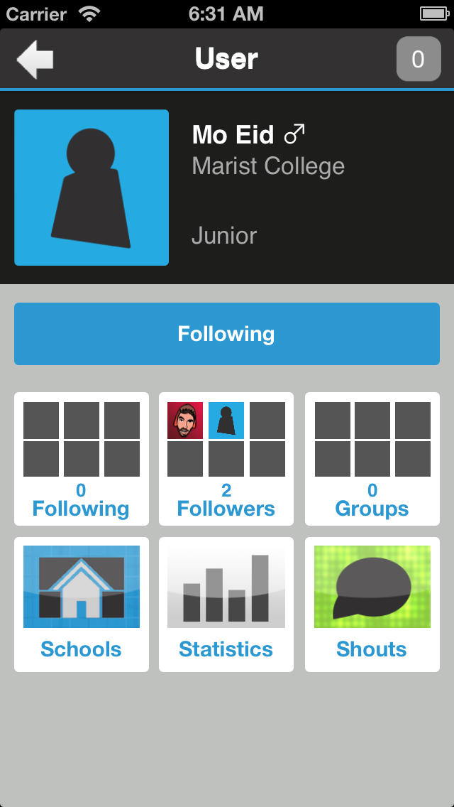
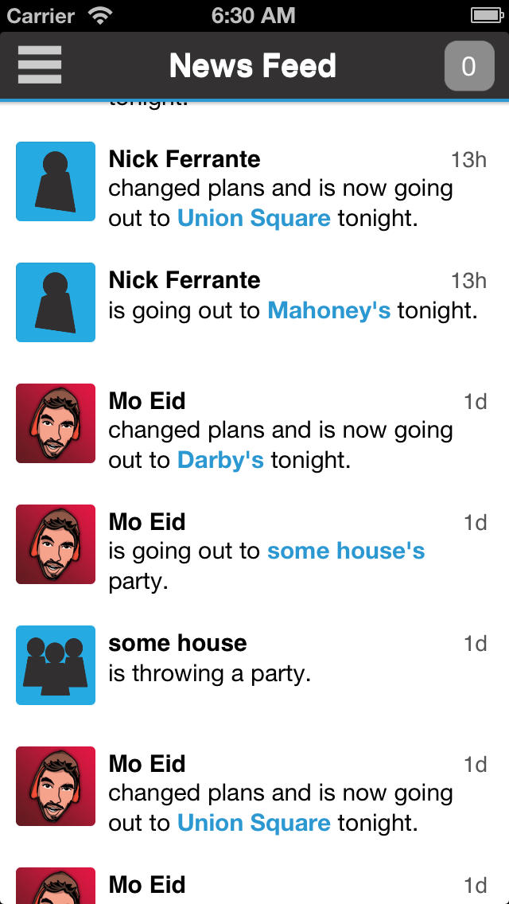
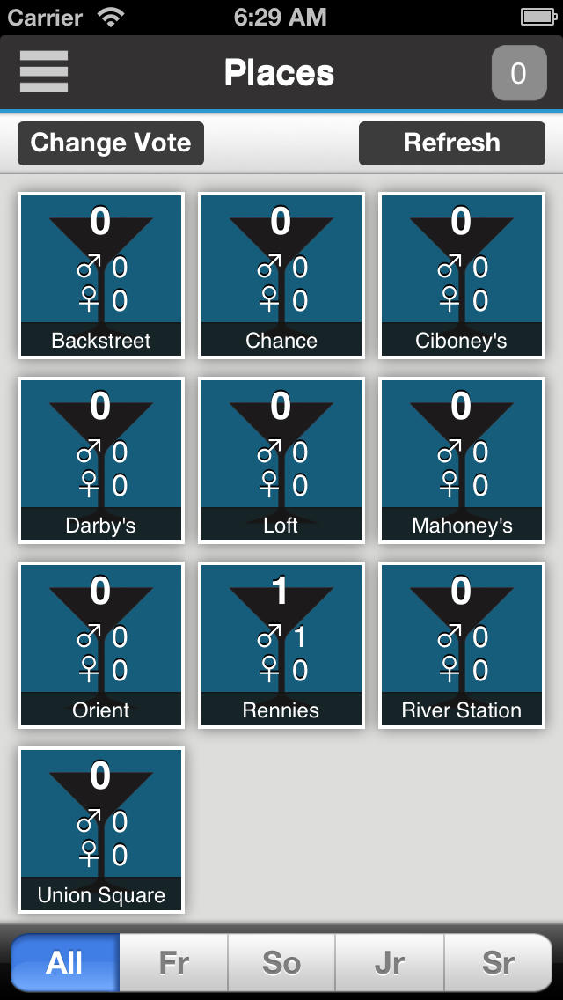
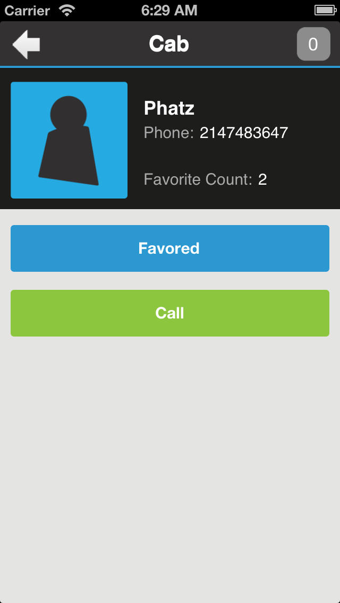

# NiteSpot

This repository hosts NiteSpot, formerly "NitSite," a entrepreneurial venture and social networking application built in 2013-2014. It is the 2014 New York Mid-Hudson Business Plan Competition for best service.

## Screenshots

<table style="width:100%">
  <tr>
    <td></td>
    <td></td> 
  </tr>
  <tr>
    <td></td>
    <td></td> 
  </tr>
</table>